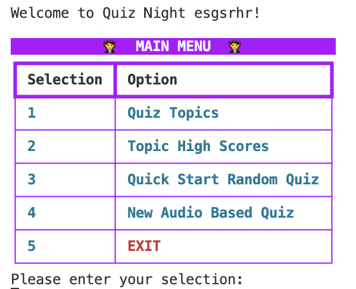
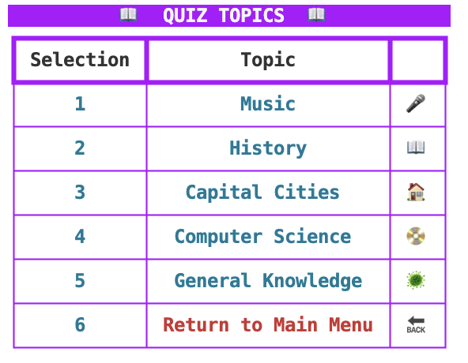
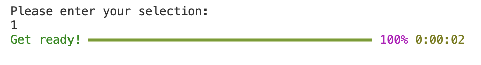
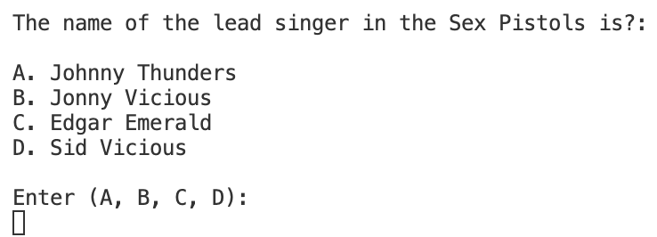
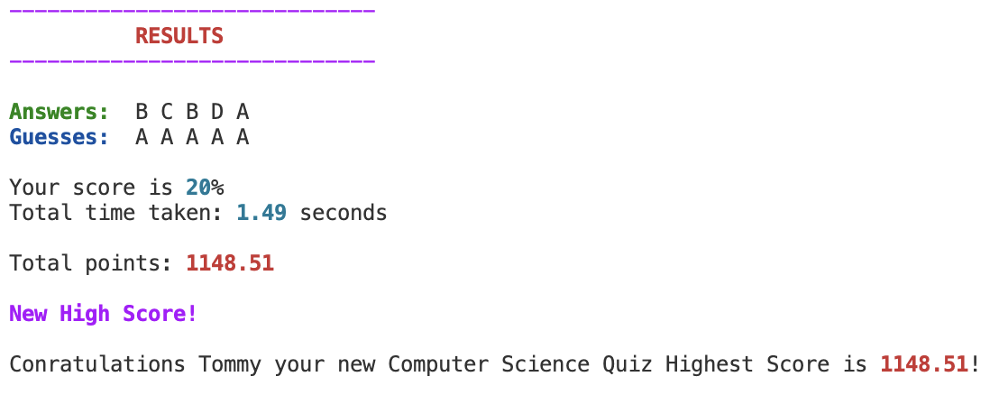

# QUIZ NIGHT TERMINAL APP GAME

#### Term 1 Assignment 3 Coder Academy 2024
#### Thomas Martin

---

### Git Repository 

Link to [Git Respository](https://github.com/TommyMart/T1A3_Terminal_App).

---

### Walk-Through Presentation  

Link to Walk Through Presentation. 

---

### Project Managment Trello Board

Link to [Trello Board](https://trello.com/b/wfUXTR4Q/quiz-night-terminal-app).

---

## Application running requirements

- The app requires python version 3.12.1 to be in installed, if you want to check which version of Python you have installed please open your terminal and run the following command ```python3 --version```. 

- If you do not have Python 3 installed no version will be displayed, that's okay, but please download it from the [Official Python Website](https://www.python.org/downloads/) before proceeding. Please follow the same procedure if you have any other version of Python installed - such as version 2. 

---

## Getting Started 

First you must clone the [T1A3 Terminal App Repository](https://github.com/TommyMart/T1A3_Terminal_App).

- Launch your terminal and enter: ```git clone https://github.com/TommyMart/T1A3_Terminal_App.git```

- Convert the run.sh file into an executable bash script by running: ```chmod +x run.sh```

- Then run the bash script which will start a virtual terminal environment: ```./run.sh```

 ---

## Packages

The application runs both external and built in Python system packages, these include:

##### System Packages
- csv
- time
- random
- getpass
- os.path

##### External Packages
- Rich

---

#### Congratulations! You've made it past the difficult part. 

#### Now let's have some fun!

## Signing Up

Firstly, as a new user you will have to create an account by entering a username and password. Please ensure you remember the password if you want to try and build on your high scores later down the track.

- Please select Y if you are a new user: <br>
```Are you a new user? (Y/N): Y``` 

- Please enter a username that is at least five characters long. <br>
```Please enter a username: ```

- Please enter a password that is at least five characters long - please be sure to remember it! <br>
```Please enter a password: ```

## Siging In

Assuming you've already signed up following the previous instructions and created an account by entering a username and password... 

- Please select N beacause you are not a new user: <br>
```Are you a new user? (Y/N): N``` 

- Please enter your username. <br>
```Please enter your username: ```

- Please enter your passwor. <br>
```Please enter your password: ```

If for any reason you cannot remember your username or password, then it's probably best to cut your losses and enter S to create a new account... Please be sure to remember your details this time!

---

##### Let's continue... 

## Main Menu



###### 1. Quiz Topics 
- Enter 1 to see the quiz topics menu.

###### 2. High Scores
- Enter 2 to see the high scores board.

###### 3. Random Quiz
- Enter 3 to quick start a random quiz.

###### 4. Instructions
- Enter 4 to see a detailed explanation of the game instructions. 

###### 5. Exit
- Enter 5 to exit the application. 

##### If you've had enough of reading and just want to jump in please be my guest! You can enter 3 and the app will select a random quiz for you to get started on. 

---

## Quiz Topics



The Quiz Topics menu shown above displays the quiz topic genres available and their corresponding numeral values. To start any of the quizzes please enter their value. 

- Enter 1 for Music 
- Enter 2 for History 
- Enter 3 for Capital Cities 
- Enter 4 for Computer Science 
- Enter 5 for General Knowledge 
- Enter 6 to return to the Main Menu 

## Playing the Quiz

If you chose to take a quiz, a 'get ready' timer bar will run before your quiz and timer starts. 


##### Ready, Set, Go!

When the the bar reaches 100% it's time to play!

The question is displayed followed by a choice of options and labelled as A, B, C, or D. The user is then prompted to enter from the following option selections. Once a selection has been entered the user is notified if they their answer is correct or incorrect, if incorrect, the correct answer is displayed to the user. 



If the user enters a character that is not from the selected options they are notified that their selection was invalid and are not able to re answer the question or shown the answer. 


Once the user has answered all the questions, their score as a percentile, time in seconds and total points are display. Total points is a function that takes the user's score and time taken and provides a total points score. If the score is a new high score the user is notifed at the end of the quiz after their results. 



The image above is notifying username - Tommy that they have achieved a new game high score of 1148.51 points! 


## High Scores


