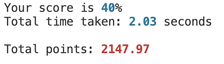

# QUIZ NIGHT TERMINAL APP GAME

#### Term 1 Assignment 3 Coder Academy 2024
#### Thomas Martin

---

### Git Repository 

Link to [Git Respository](https://github.com/TommyMart/T1A3_Terminal_App).

---

### Project Managment Trello Board

Link to [Trello Board](https://trello.com/b/wfUXTR4Q/quiz-night-terminal-app).

---

## Application running requirements

- The app requires python version 3.8 or higher to be in installed, if you want to check which version of Python you have installed please open your terminal and run the following command ```python3 --version```. 

- If you do not have Python 3 installed no version will be displayed, that's okay, but please download it from the [Official Python Website](https://www.python.org/downloads/) before proceeding. Please follow the same procedure if you have any other version of Python installed - such as version 2. 

---

## System / Hardware Requirements

There are no system or hardware requirements for the application besides the device needs to have a terminal to run the app. The application does not need much processing power so should be runnable on all modern devices. 

The application has been designed to run on the following operating systems:

- macOS
- Windows
- Linux

Please also make sure that Python 3.8 or is installed.

--- 

## Getting Started 

First you must clone the [T1A3 Terminal App Repository](https://github.com/TommyMart/T1A3_Terminal_App).

Alternatively, download the zipped folder and via your terminal nevigate to the root directory of the app by using change directory ```cd``` command. 


###### Need Help?

If you're unsure where abouts you are within the file tree of your device, you can execute the print working directory command ```pwd```, which will print the directory in which you currently are. Another great command is ```ls```, this stands for list and will list all the files and directories within the current directory. If you want to move into a directory within that list use the change directory command ```cd```. 

##### Feel free to copy and paste the following code steps! 

- Launch your terminal and enter: ```git clone https://github.com/TommyMart/T1A3_Terminal_App.git```

- Convert the run.sh file into an executable bash script by running: ```chmod +x scripts/run.sh```

- Then run the bash script which will start a virtual terminal environment: ```scripts/run.sh```

Incase you thought you had Python 3.8 or higher installed but you don't, the terminal will let you know after you run the above code.

If for the unlikely reason the above steps aren't working, please install Python 3.12 or higher and try again. 

 ---

## Packages

The application runs both external and built in Python system packages, these include:

##### System Packages
- csv
- time
- random
- getpass
- os.path

##### External Packages
- Rich

These are downloaded automatically in a virtual environment when running the run.sh file above. 

---

## Code Style Guide

The chosen code style guide for the applicaton is [Pep 8](https://peps.python.org/pep-0008/).

Initially, the code was manually styled as per the Pep 8 guidelines above so that the style guide was successfully learnt. Then autopep8 v2.1.0 was installed and ran on the three .py python files for a more aggressive take on the styling rules. The link to the external package can be found [here](https://pypi.org/project/autopep8/). 

---

#### Congratulations! You've made it past the difficult part - now let's create a username and password. 

## Signing Up

Firstly, as a new user you will have to create an account by entering a username and password. Please ensure you remember the password if you want to try and build on your high scores later down the track.

- Please select Y if you are a new user: <br>
```Are you a new user? (Y/N): Y``` 

- Please enter a username that is at least five characters long. <br>
```Please enter a username: ```

- Please enter a password that is at least five characters long - please be sure to remember it! <br>
```Please enter a password: ```

## Siging In

Assuming you've already signed up following the previous instructions and created an account by entering a username and password... 

- Please select N beacause you are not a new user: <br>
```Are you a new user? (Y/N): N``` 

- Please enter your username. <br>
```Please enter your username: ```

- Please enter your passwor. <br>
```Please enter your password: ```

If for any reason you cannot remember your username or password, then it's probably best to cut your losses and enter S to create a new account... Please be sure to remember your details this time!

---

#### Now let's have some Quiz Night fun!

## Main Menu


###### 1. Quiz Topics 
- Enter 1 to see the quiz topics menu.

###### 2. Topic High Scores
- Enter 2 to see the high scores board.

###### 3. Quick Start Random Quiz
- Enter 3 to quick start a random quiz.

###### 4. Quiz Instructions
- Enter 4 to see a detailed explanation of the game instructions. 

###### 5. EXIT
- Enter 5 to exit the application. 

##### If you've had enough of reading and just want to jump in, please be my guest! You can enter 3 from the main menu and the app will select a random quiz for you to get started on. 

---

## Quiz Topics


The Quiz Topics menu shown above displays the quiz topic genres available and their corresponding numeral values. To start any of the quizzes please enter their value. 

- Enter 1 for Music 
- Enter 2 for History 
- Enter 3 for Capital Cities 
- Enter 4 for Computer Science 
- Enter 5 for General Knowledge 
- Enter 6 to return to the Main Menu 

## Playing the Quiz

If you chose to take a quiz, a 'get ready' timer bar will run before your quiz and timer starts. 


##### Ready, Set, Go!

When the the bar reaches 100%, it's time to play!

The question is displayed followed by a choice of options and labelled as A, B, C, or D. The user is then prompted to enter from the following option selections. Once a selection has been entered the user is notified if they their answer is correct or incorrect, if incorrect, the correct answer is displayed to the user. 


If the user enters a character that is not from the selected options they are notified that their selection was invalid and are not able to re answer the question or shown the answer. 


Once the user has answered all the questions, score percentile, time and total points are displayed. Total points is a function that takes the user's score and time taken and provides a total points score for the sake of the high scores board. If the score is a new high score the user is notifed at the end of the quiz after their results as shown in the image below. 


The image above is notifying username - 'Tommy' that they have achieved a new game high score of 1148.51 points! 


## Topic High Scores


Accessible by entering 2 from the main menu is the topic high scores table. Here, any user on the device can view the top 3 highest scores for each topic and the username of the user who achieved the score. Luckily, high scores are not just viewable for the current username signed in but for all usernames, allowing users to compete against one and other for the top spot! 

The image above only shows Tommy's scores because at this stage they are the only user to have played any quiz. If no quiz has been played the high scores table is not shown, instead the user is notified that there are no quiz scores to be displayed. 

## Quick Start Random Quiz

This option from the main menu is for those who don't like waiting! This allows users to jump straight in and let the app decide which quiz topic the user will take. Those topic choices are of course music, history, captial cities, computer science and general knowledge. 

## Quiz Instructions

Unlike the main menu selection above, instructions, accessible by entering 4 from the main menu, is for those are like to understand the ins and outs of the app before playing. Or, of course, if the user doesn't understand something. 

## EXIT

Maybe you've had enough, or, more likely, maybe your sister wants to try and beat your new high score! 

You can probably guess what entering 5 does from the main menu.. Yes, you're correct, it exits the app. 

```"Goodbye, we hope to see you again soon!"```

---

## FEATURES

##### For further explanation of the code with a visual representation, please refer to the in-code comments in the main.py, quiz_functions.py and quizzes.py Python files. 

### Sign In/Up Feature

A sign in / up feature that requires a password will be implemented. The main reason for this feature is because of the high scores table and the username associated with the scores. Just having the scores by themselves and no name attached would not have the same effect. 

The sign up feature requires the user to enter a username that is five characters or more long, it is then converted to a title (capital first letter) to greet the user once sign up is completed. The next user requirement is a password, this also needs to be 5 or more characters long. The username and password is then written to a csv file called user_names.csv to facilitate the sign in function. 

The sign in function require the user to enter their previously entered username and password, entered during the sign up feature, that opens and reads the user_names.csv file. While reading the file, using a for loop, the application check to see if the username matches an existing username, if there is, it then checks to see if the password matches. If the entered two values match an existing two values, the user is granted entry to the quiz under the entered username. If a match is not found, the user is then asked if they would like to sign up with a new account, or, try and sign in again. 

- Import csv system package.
- Create a csv file called user_names.csv and assign it to the second_file_name variable.
- Open the variable under write mode so that a file is created if one does not already exist.
- Write username and password to the file seperated by commas so the app can access each during sign in/up.
- Close the app, because 'with' was not used.

##### Sign Up

- Input username that is at least 5 characters long. 
- Input password that is at least 5 characters long.
- Write new username and password to csv file.
- Welcome username.

##### Sign In

- Input username.
- Input password. 
- Open csv file variable in 'r' (read) mode. 
- Loop through each row of csv file and see if username matches index 0 in the row list, if a match is found, check if password matches index 1 of that specific row list. 
- If found, Welcome user to the Quiz Night app and return their username.
- If not found, notify the user they have not entered the right username or password. Or, give them an option to return to sign up function. 

Error handling has been ulitised by printing a incorrect username or password string if there isn't a match, the user then has the opportunity to retry or enter s to sign up. If the user enters a character other than Y or N, then 'Invalid input. please enter Y or N' is displayed. Try and except code error handling has also been added in case of the unlikely event that an error is thrown during the main, sign_in or sing_up functions. 

```"Oops! Something seems to be not working, please try again."```


### Quiz Feature 

Some may think, hmmmm, writing code for a quiz must be pretty easy... Well, I've got news for you! Let's put aside time taken and total points for now, I'll explain them later. 

Initally, a function was written that takes the topic choice, question, four answer options, answer and username. The questions, answers and options must then be bundled together and randomly sorted so that their indexes remained constant between the sets but shuffled for each quiz attempt. This allows the question order to be at random, eridicating the chance of users writing down or memorising the answers and input them without reading the question. 

This is achieved by zipping the lists, using the random shuffle package to shuffle, and then assign the newly shuffled lists to new variables - shuffled_questions, shuffled_options, shuffled_answers. These new variable lists can now be used for the quiz and will have the same corresponding indexes, so the questions, options and answers still marry up. 

```combined = list(zip(questions, options, answers))
    random.shuffle(combined)
    shuffled_questions, shuffled_options, shuffled_answers = (*combined)```

To walk through this process step by step...
- The combined zipped variable results in a tuple including one question, four guess options and the answer. 
- Since they are now zipped in seperate tuples, they can now be shuffled without getting mismacthing questions, options or answers. This is executed with the help of the random.shuffle package.
- The * is then used to unpack the combined zipped variable into new 'shuffled' tuples with new a random order but with all questions, options and answers still matching! 


A score counter is initiated and set to 0, that increases by one every time the users guess and answer match. This final score is then displayed at the end of the quiz as a percentile. Using ```score = int(score / len(shuffled_questions) *100)``` It is also used to calculate the total points along with the total time taken.

A variable question_num is set to 0, and a for loop is used to loop through the shuffled questions, options and answers, using question_num for the index of each, which is then increased by 1 after displaying the result to the user at the end of the loop. Since the questions data is a set, the for loop will loop through question in questions until there are not more questions. 

The quiz is executed using a for loop, where for question in shuffled questions the question is printed, and then a nest for loop to print the four options as ```for option in shuffled_options[question_num]:``` because this is a nested loop it will keep looping until all options in shuffled_options has been looped for whatever index the question_num is on. If the users guess equals the shuffled_answers and the same question_num idex then, you guest it, correct guess! And the score counter increasese by 1. The users guess is also appended to a guesses list to display at the end of the quiz and the user guess is made a capital because you'd be pretty annoyed if you entered a when the answer was A and you were marked incorrect! An elif statement is used for if the users guess is incorrect, which is displayed and also an else statement if the user enter something that isn't A, B, C, or D. Finally at the end of the loop, the question_num counter is increased by one so that the shuffled lists index all match for the next loop. 

The counter question_num was implemented so that the quizzes can be manipulated in the future, maybe to add more questions, or even change the data for CS Fundamental test revision next semester. 

The results are then displayed as answers and guesses, a percentile score and total time. 


Error handling has been utilised by printing 'Incorrect!' if the user enters a wrong answer, followed by a string displaying the correct answer. If the user enters an input that doesn't match the options, A, B, C or D, the a message is displayed that the input was not a valid answer. This alone should handle most errors, but just in case a try and except code is executed in case of any unlikely errors. The progress bar also has a try and except block, just in case it doesn't work on some operating systems. 


### Total Points and Time Taken Feature

To eliminate the chance of a user googling the answers a total points scoring function is created using score, number of questions and total time. 

A time stamp is saved to a start_time variable which happens after the get ready progress bar has reached 100%, this is achieved by using the time package. The quiz loop then runs for all questions and then another time stamp is saved to a end_time variable. The total time is calculated by subtracting the start time and from the end time which is displayed to the user as 'total time taken' in the results section and then passed to the calculate_points function to calculate total points. 

The calculate points function take the score, which is a percentile and multiplies is by 50, and saved to the score points variable. This is done to give the calculation some room to move when taking time into account. A variable max time is calculated by muliplying the number of questions in the quiz with the allocated time of 30 seconds per question, if the user takes less time than the allocated 30 seconds per question max time for the overall quiz, then that time difference is added to the score points variable. 

This might be a little confusing... so here's an example to clear things up. 

- If there was 5 questions in the quiz
- And the user got questions 3 correct 
- Their score would be 60 (3 / 5 * 100)
- Their score points would be 300 (60 * 50)
- Their max time would be 150 seconds (5 * 30) 
- Let's say their total time is 120 seconds
- Their time points would be 30 (150 - 120)
- Their total points would therefore be 330 (300 + 30)



This way the user is rewarded when they take less time than the allocated 30 seconds per question. 

The total points, username and quiz topic are then appended to the list.csv so that the high scores feature can read, then reverse sort the lists based on total points so that the 3 highest scores can be displayed and their username. 

A csv file is created at the start of the quiz "w" write mode if it has not been made already and the headings topic, score (total points) and username are written to the first row. The data is then appended to the list so it can be read at different stages of the app. 

Error handling has been implemented into the code by using try and except on the quiz function itself, in which the time variables are assigned locally. The calculate points function also has try and except incase any unlikely errors should occur. 


### High Scores Board Feature

The high scores board opens the list.csv file that was saved to the variable file_name in 'r' read mode, and appends each row entry of topic, score and username to a list. 


Because the file was opened with ```with``` the file does not need to be closed. This then seperates the scores into their topics, this is important so that the board can display the highest scores for all topics and not just the highest overall. This is achieved by using a for loop, and if the first index ```i[0]``` equals 1 for example, ```i[2]``` username, now index 0, and ```float(i[1])```, now index 1, are appended to the music topic list - and the same for all other list topics. Topic is not added because it has already been used to seperate the data into their topic lists. 

Once the loop has appended all the rows data to their corresponding topic lists, the lists are then sorted using the .sort method and in reverse based on index 1, ```x[1]``` or scores, so that the highest scores are at the start of the list and lowest at the end.  

List comprehension is then used to extract the first 3 highest scores in each list. ```list[:3]``` iterates over the first three lists, or highest three scores, within the parent list and displays their scores or index 1. ```score[1]:.2f``` means that only two decimal points will be displayed of the float, the rest will be cut off. Index 0 is also displayed, which as mentioned previously, is now username in this new list. This enables users to know who achieved the high scores, which is crucial in a competative game environment. 

These results are then printed to the termal as a rich external package module table in different colours for 1st, 2nd and 3rd.  


During the writing of this function, a bug arose where if the topic high scores were called when the csv scores list had not been created yet. In this scenario the application was trying to read a file that did not exist, so it threw a tantrum. After some trial and error coding, this bug was resolved by using try and except, if the file did not exist it meant that no one has attempted a quiz yet, because the write file was at the start of the quiz function. This file could have been moved so that it was created earlier, but I decided to use the except block to print ```Sorry, there's no quiz scores to show right now.``` instead. This way the user is more inclined to want to attempt a quiz so they can see what the high scores board looks like!

A parent try and except was also used at the very start of the function so if any unlikely errors were to occur they would be caught and a more appropriate message would be displayed. 


### Random Quiz Feature

The random quiz feature takes the username, passed from the sign in/up to the main menu, to the topic choice through to the random quiz function. The function then uses the random package to assign a random integer between 1 and 5, because there are 5 quiz topics, to the variable rand_quiz. That variable rand_quiz integar is then passed to quiz topics function and the rand_quiz integer variable is then assigned to topic choice which runs the quiz with the corresponding random integar. The quiz topic table is not ran because the rand_quiz does not equal None. 

For example: 

- If the random integer is 1, the topic choice is 1 and the music quiz is ran.
- If the random integer is 4, the topic choice is 4 and the computer science quiz is ran. 

For the users quiz score and username to be appended to the list csv file, the username must also be passed through the functions. The rand_quiz must also be set to equal None in the quiz topics function so that is the function is called from the main menu, rand_quiz doesn't not impact what quiz is ran. 

Error handling was implemented to this function by using try and except. The random integer can also only be between 1 and 5 which corresponds to each quiz, so that no errors can occur. 

---

## PROJECT MANAGEMENT

For project management and planning a Trello Board was created, this provided a due date for each feature and a checklist of items needed to be completed to satify the completation of the feature. Once done the feature card is able to be moved to the 'Done' category, this greatly helped in organisation, time management and lessened stress when not knowing which feature to work on. 


### Sign Up/In

Due date: 3rd May 
Completion: 1st May

- Import csv system package.
- Create a csv file called user_names.csv and assign it to the second_file_name variable.
- Open the variable under write mode so that a file is created if one does not already exist.
- Write username and password to the file seperated by commas so the app can access each during sign in/up.
- Close the app, because 'with' was not used.

##### Sign Up

- Input username that is at least 5 characters long. 
- Input password that is at least 5 characters long.
- Write new username and password to csv file.
- Welcome username.

##### Sign In

- Input username.
- Input password. 
- Open csv file variable in 'r' (read) mode. 
- Loop through each row of csv file and see if username matches index 0 in the row list, if a match is found, check if password matches index 1 of that specific row list. 
- If found, Welcome user to the Quiz Night app and return their username.
- If not found, notify the user they have not entered the right username or password. Or, give them an option to return to sign up function. 


### Quiz 

Due date: 1st May
Completation: 1st May

- Write a quiz function that takes the index, or question number, and accesses each index within the three questions, options and answer lists, then returns if the users guess is equal to the answer.
- Input quiz questions, options and answer data as sets. 
- Shuffle the questions, answers and options using the random function so that the order of questions change each time.  
- Keep track of scores using a score += counter per correct user guess. 
- Write a string that informs the user if their guess was correct or incorrect per question. 
- Display a string of the users guesses and the correct answers.
- Display the users score as a percentile. 


### Total Points and Time Taken

Due Date: 3rd May
Completion 1st May

- Write a time stamp to use as start time.
- Write a time stamp to use as end time.
- Write a calculation that works out total time taken.
- Write a function that takes total time taken and score and calculates a total points score that produces a higher score the less time the user takes. 
- Write a string that display total points at the end of the quiz. 
- Error handling so if an error occurs during the calculate points function of quiz function.


### High Scores Board

Due Date: 4th May
Completion: 2nd May

- Open the csv file which hold the topics, scores and username in read mode. 
- Append row data to new lists based on topic number.
- Sort list from highest score to lowest score.
- Display first three lists within list username and score for each new list.
- Add this data to display in a table.
- Write error handling for function itself and if the csv list doesn't exist.
- Test it works. 


### Random Quiz

- Import Random. 
- Write random function that generates random a integer between range 1 and 5 inclusive each time it is called. 
- Pass that number to the Quiz function so that the random integar equals the quiz topic value.
- Ensure the high scores board does not produce an error if the scores csv file has not yet been created. 
- Write error handling should an error occur. 
- Test it works. 


### Other Cards

Some other cards used in project management trello board are:

- Error Handling
- Aesthetics 
- Package research
- Quiz Data
- Main Menu
- Quiz Topics Menu
- Write Scripts

##### Work in progress Trello Board


### Testing

Due date: 4th May
Completed 4th May

Testing is the final step from a project management perspective. This will be achieved manually by trying to run through every possible scenario. The file will also be passed to my fellow students, preferably running different operating systems, to test the functionality of the quiz, make sure no errors occur, and that the bash scripts install the correct packages in the virtual encironnent. 

---

Given user terminals are often ran with a black background, colours were tested against this background to ensure the visability of the app was adequate. With some minor adjustments the colours used with a black terminal look great! And have a high contrast that should be easily visable for most. 

##### Main Menu on dark background


##### Quiz Topic Menu on dark background


---

## Error Handling

Error handling has been used at the start and end of all functions using try and except, this means the user will not be shown any ugly terminal errors, instead they will see ```Oops! Something seems to be not working, please try again.```

Error handling has also been implemented into some of the child functions and loops that may cause an error, like the progress bar, just in case it doesn't work on a different operating system. Else statements have also been used to as a likely input or to catch invalid inputs or unexpected errors. 

---

## Challenges 

#### DRY

Initally the menus were called in a one function, but due to wanting to add emojis and extra columns and rows, plus table styling from the rich module, it was decided to write them seperately. I understand that a function could have been used but this would have come at the expense of the overall quality and user experience of the app. 

#### Pep 8

In some instances the Pep 8 guidelines were overridden based common sense and readability. This occured mainly during the table rows and columns, where the recommedned line length was exceeded. I thought it was important that each column and row stayed as one line of code to avoid messy and confusing code. 

---

## Reference List

- Hattori, H n.d., autopep8: A tool that automatically formats Python code to conform to the PEP 8 style guide, PyPI.
- Python 2019, Download Python, Python.org, Python.org.
- van Rossum, G, Warsaw, B & Coghlan, N 2001, PEP 8 – Style Guide for Python Code, peps.python.org.
